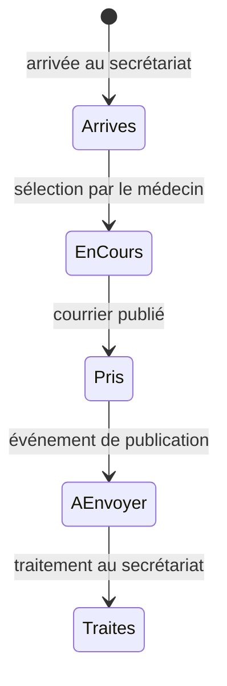

# Architecture et fonctionnement — 2026.09-audit1

## Répartition

| Emplacement | Rôle |
|---|---|
| `\\DS224\CabinetCardio` | Patients, agenda annuel, journal des actes, dictionnaires, modèles, brouillons et files d'échange |
| `\\DS224\home\sortiedragon` | Destination configurée des courriers DOCX/PDF publiés |
| PC secrétaire | `Cabinet.xlsm`, saisie administrative, arrivées, rendez-vous, actes et impression |
| PC médecin | `CabinetUnifie.dotm`, Dragon, correction API, lettres annexes, préparation de l'identité ECG |
| `%APPDATA%\CabinetCardio` | Configuration du poste, exécutables locaux, versions et sauvegardes d'installation, cache SQLite |
| `C:\Mandagout\IMPORT.GDT` | Identité destinée à Resting12Lead sur le PC médecin |

Un seul complément Word regroupe les commandes du médecin. Excel reste l'application du secrétariat : ce n'est pas un exécutable autonome remplaçant Office. Le moteur de courrier et d'annexes provient de PROD6 ; les règles de gras et les fonctions de cabinet proviennent de Cabinet(1)/Cabinet.xlsm.

## Saisie et consultation

1. Le secrétariat crée ou retrouve le patient : nom, prénom, date de naissance, **sexe**, adresse, téléphone et médecin traitant. Le sexe est requis pour l'identité ECG ; il n'est jamais déduit automatiquement. Des champs administratifs complémentaires restent disponibles dans le formulaire existant.
2. Le secrétariat gère le rendez-vous et signale l'arrivée. L'annonce contient l'identifiant patient et l'identifiant du rendez-vous. Il n'y a pas d'export ECG depuis le secrétariat.
3. La touche **A** affiche les patients arrivés aujourd'hui. Le médecin choisit explicitement le patient ; aucun choix automatique du premier nom. L'arrivée est réservée, puis l'identité est relue sur le NAS, le brouillon Word est créé et le fichier GDT est produit. La base locale est un cache, pas une nouvelle source d'identité.
4. Le médecin dicte son raccourci Dragon pour le destinataire. **B** place le curseur à la formule d'appel puis au corps de la lettre. **C** insère « NOM Prénom, âge » à la position de saisie, après vérification de l'identité du document.
5. **D** sauvegarde le brouillon, appelle le moteur OpenAI pour la correction, puis pour les annexes lorsqu'une demande est détectée. Les règles de gras Cabinet sont appliquées. Les documents DOCX/PDF sont enregistrés avant l'annonce au secrétariat. Toute erreur interrompt le traitement et est signalée.
6. Le secrétariat ouvre la file, vérifie et imprime les courriers, enregistre les actes, imprime éventuellement la feuille de soins papier et propose un nouveau rendez-vous. Le journal utilise l'identifiant stable de la consultation pour empêcher un double enregistrement lors d'une reprise.

Les macros Dragon à affecter sont celles du module `modPowerMicUnifie` : `Unifie_A_NouvelleLettre`, `Unifie_B_FormuleAppel`, `Unifie_C_InsererPatient`, `Unifie_D_Finaliser`. Les anciennes macros homonymes de `Normal.dotm` ne sont pas supprimées automatiquement.

## États et reprises

Le diagramme représente l'ordre logique ; les transitions utilisent plusieurs fichiers. Il n'existe pas de transaction unique englobant toutes les écritures NAS. Une interruption peut donc laisser un brouillon ou une réservation à reprendre. La commande de reprise affiche aussi les réservations interrompues. Ne pas déplacer manuellement un dossier `EnCours` tant que la consultation peut être ouverte sur un autre poste.

Une publication possède son identifiant de révision. La consultation conserve son propre identifiant, préfixé par l'année du rendez-vous, car les numéros d'agenda peuvent recommencer chaque année. Une nouvelle révision d'un courrier ne doit pas créer une deuxième séance comptable.

## Données et confidentialité technique

Le cache SQLite local contient l'identité, le médecin traitant et les métadonnées du rendez-vous nécessaires à la file. Il est reconstruit à partir du NAS ; une panne NAS ne doit pas autoriser l'utilisation silencieuse d'une ancienne liste. Les lectures Excel produisent aussi des copies temporaires locales des classeurs, supprimées après lecture. L'architecture actuelle ne garantit donc pas l'absence de toute copie transitoire de données hors du NAS.

La clé OpenAI reste locale : variable d'environnement `OPENAI_API_KEY`, ou fichier `%APPDATA%\CabinetCardio\openai.key`. Elle ne va ni dans le dépôt ni dans `config.ini`. Le transport unifié utilise `store:false` et ne journalise pas les corps des requêtes/réponses. Le masquage dirigé par la fiche patient et les contrôles de balises **ne constituent pas une anonymisation exhaustive** du texte libre.

La génération reste soumise à la relecture du médecin : destinataire, identité, négations, doses, examens et indication. Le code ne peut pas certifier l'exactitude médicale d'une réponse générée.

## Architecture conseillée pour la suite

La priorité suivante est un petit service métier sur le Synology, avec une base serveur PostgreSQL ou MariaDB et des comptes distincts. Il deviendrait l'unique autorité pour patients, rendez-vous, consultations et écritures comptables. Word et Excel seraient des clients ; les fichiers de courrier resteraient sur le NAS. L'identifiant d'une publication et son événement de file seraient enregistrés dans la même transaction, avec reprise explicite des écritures de fichiers.

La base SQLite resterait locale au médecin. Ne pas déplacer son fichier sur un partage SMB pour en faire une base multi-utilisateur : [les contraintes de SQLite/WAL](https://www.sqlite.org/wal.html) ne correspondent pas à ce fonctionnement.

Il faut également unifier l'annuaire du médecin traitant et celui des spécialistes autour d'identifiants stables, extraire les anciennes branches VBA inutilisées, puis isoler des modules testables pour l'identité, les montants et les transitions d'état. Cette migration n'a pas été réalisée dans cet audit et ne doit pas écraser les bases existantes.
