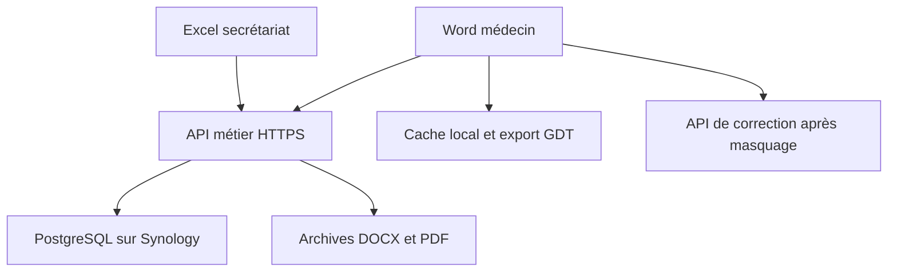

# Architecture de la version service NAS

## Responsabilités

| Élément | Responsabilité | Stockage |
|---|---|---|
| Excel secrétariat | Saisie, agenda, arrivée, file des courriers, actes, export du journal | Aucun classeur de base modifié directement |
| Word médecin | Dragon, signets, A/B/C/D, API et relecture | Brouillons/documents sur le partage Synology |
| Cache SQLite | Dernières arrivées reçues, sélection locale | PC médecin uniquement, reconstructible |
| API métier | Authentification, rôles, validation, transitions et conflits | Conteneur Synology |
| PostgreSQL | Patients, correspondants, agenda, nomenclature, dictionnaires, séances, publications et journal | Volume local Synology |
| Documents publiés | Versions DOCX/PDF conservées sous empreinte SHA-256 | `Documents` du partage NAS |

Les lectures d'identité se font par ID ; la recherche et l'agenda sont filtrés côté service. Les journaux sont paginés. La vue de semaine ne charge que les patients des rendez-vous affichés. Le cache des listes de gras Word reste temporaire en mémoire ; les dictionnaires sont désormais modifiés via le service.

## Contrat de commande

`POST /v1/rpc`, en-tête `Authorization: Bearer ...`, JSON `{operation, params, request_id}` ; réponse `{result: ...}` ou `{error: ...}`. Le client utilise HTTPS, refuse les redirections, borne les délais et la taille de réponse. Le serveur borne le corps entrant à 4 Mo.

Les mutations sont sérialisées par verrou transactionnel PostgreSQL, puis enregistrent résultat et événement dans la même transaction. Une commande rejouée avec le même compte/ID et le même contenu restitue son résultat ; un contenu différent est refusé. Les formulaires envoient `_revision` pour éviter d'écraser la modification d'un autre poste. Le verrou est libéré au commit/rollback, pas selon l'âge d'un fichier. Voir [verrous PostgreSQL](https://www.postgresql.org/docs/current/explicit-locking.html) et [transactions psycopg](https://www.psycopg.org/psycopg3/docs/basic/transactions.html).

| Commandes | Accès |
|---|---|
| Patients, RDV, arrivée, annulation, actes, paiement, impression et acquittement | Secrétariat |
| Réserver/libérer, brouillon, publier et reprendre | Médecin ; propriétaire de la consultation pour les modifications |
| Correspondants et ajout aux dictionnaires | Médecin et secrétariat |
| Journal comptable | Secrétariat |
| Comptes et rapprochement | CLI administrateur locale au conteneur, aucune route d'administration publique |

## Invariants

- Une arrivée par rendez-vous ; deux rendez-vous d'un même patient restent distincts.
- Seuls les rendez-vous du jour sont marqués arrivés. Un créneau en conflit est refusé dans la transaction.
- Une réservation active appartient à un compte. La présence d'un brouillon empêche sa libération automatique.
- L'identité et la date de consultation sont contrôlées avant publication et facturation.
- Une publication exige un destinataire identifié, une confirmation de relecture et deux fichiers présents et valides.
- Les fichiers sont copiés et synchronisés sur disque avant le commit SQL. Si le commit échoue, un fichier non référencé peut rester ; aucune publication incomplète n'apparaît dans la file. `reconcilier` le signale. Il n'existe pas de transaction distribuée PostgreSQL/SMB.
- Une nouvelle publication remplace la version en attente de la même consultation. Une ancienne version ne peut pas acquitter la nouvelle.
- Une seule séance comptable par consultation. Le premier enregistrement vérifie les tarifs du serveur et fige les identités/montants ; la réimpression relit cette séance.
- L'acquittement met à jour publication, consultation et statut d'agenda dans la même transaction. Le tiers payant n'est pas assimilé à un encaissement.

## Correction des courriers

Le transport reste celui de PROD6, via OpenAI Responses. Une sortie JSON stricte remplace le texte libre pour le contrat : `corps_courrier` et `demandes[{cle_destination, corps}]`. Le parseur vérifie types, champs obligatoires, doublons et délimiteurs internes. Les délimiteurs historiques ne sont reconstruits qu'après cette validation pour alimenter le moteur Word existant. Le format `text.format` suit la [documentation des sorties structurées](https://developers.openai.com/api/docs/guides/structured-outputs).

Le résultat est comparé à la source sur les nombres/unités, négations et marqueurs d'identité. Les différences sont montrées au médecin. Il s'agit de contrôles de régression, pas d'une validation sémantique médicale ; une phrase peut changer de sens sans modifier ces marqueurs. La relecture de toutes les pages reste obligatoire, y compris des annexes. Les positions/signatures et le gras sont ensuite ceux des moteurs repris et corrigés.

Le masquage du texte libre demeure incomplet par nature : il ne garantit pas de retirer tous les identifiants dictés. Aucun corps de requête/réponse n'est journalisé par le nouveau transport/service. Les anciens appels de journalisation métier VBA ne persistent plus leur texte, qui pouvait contenir des noms ou chemins.

## Découpage du code

`Serveur/cabinet/domain.py` porte les règles pures ; `service.py` les transactions ; `files.py` les archives ; `api.py` le transport ; `migration.py` l'import ; `admin.py` l'exploitation. Le schéma est versionné. Les clients utilisent `modServiceNas`, avec des adaptateurs conservant les signatures des formulaires Office.

Les modules aux noms trompeurs deviennent `modApiConfiguration`, `modDestinations`, `modDemandesAnnexes`. Sept anciens composants de saisie et deux modules de tests historiques ont été retirés du manifeste ; 47 procédures privées sans référence ont été supprimées. Les anciens points publics compatibles sont conservés lorsqu'une commande Dragon externe peut encore les appeler, et les transports concurrents restent désactivés. Le constructeur retire les composants non déclarés avant d'injecter les sources.

La sérialisation globale des mutations convient au volume d'un petit cabinet. Une augmentation importante du nombre d'utilisateurs demandera des mesures et des verrous plus fins. Le journal métier n'est pas un journal d'audit cryptographiquement inviolable.
